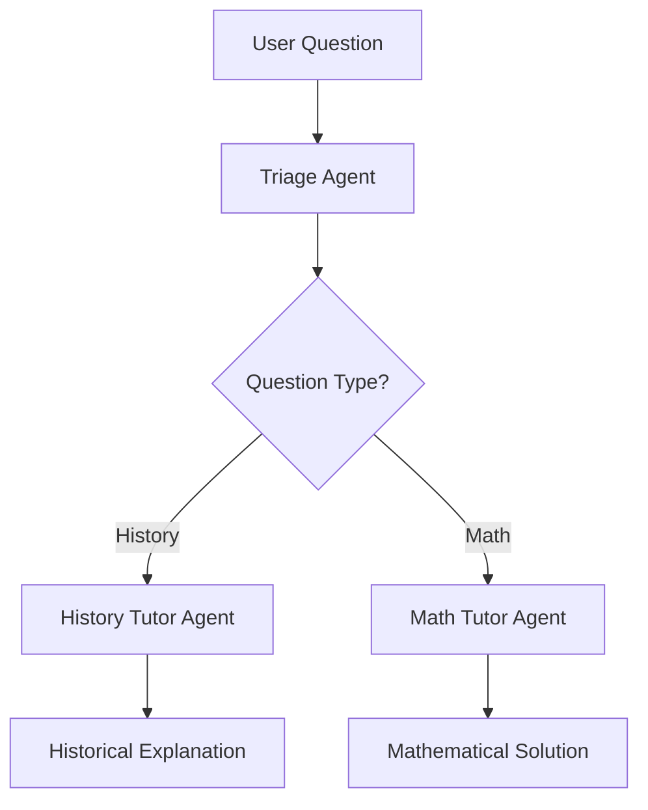

<div align="center">
     <br/>
    <strong>Build Agents, Not Infrastructure</strong> <br/>
    <br/>
        <a target="_blank" href="https://app.agentuity.com/deploy" alt="Agentuity">
             
        </a>
    <br />
</div>

# 🤖 OpenAI Agents Integration with Agentuity

This project demonstrates how to integrate OpenAI's multi-agent framework with Agentuity, featuring two sophisticated agent implementations that showcase different patterns for AI agent development.

## 🎯 Featured Agents

### 1. 📚 **Tutor Agent** - Multi-Agent Handoff Pattern
An intelligent tutoring system that routes questions to specialized agents based on subject matter.

**Key Features:**
- **Smart Triage**: Automatically determines whether questions are about history or math
- **Specialized Agents**: Dedicated history and math tutors with domain expertise  
- **Agent Handoffs**: Seamless delegation between agents for optimal responses
- **Educational Focus**: Explains reasoning and provides step-by-step solutions

### 2. 🛡️ **Human-in-the-Loop Agent** - Approval Workflow Pattern
A weather agent that demonstrates controlled AI execution with human oversight for sensitive operations.

**Key Features:**
- **Approval Gates**: Pauses execution to request human approval for specific actions
- **State Persistence**: Uses Agentuity KV store to maintain agent state across requests
- **Selective Control**: Some operations run automatically, others require approval
- **Resume Capability**: Continues exactly where it left off after approval
- **Clean Architecture**: Robust error handling and state management

## 📋 Prerequisites

Before you begin, ensure you have the following installed:

- **Node.js**: Version 18 or higher
- **Bun** or **npm**: For package management
- **OpenAI API Key**: Set as environment variable

## 🚀 Getting Started

### Authentication

First, authenticate with Agentuity:

```bash
agentuity login
```

### Environment Setup

Set your OpenAI API key:

```bash
agentuity env set OPENAI_API_KEY your_api_key_here
```

### Development Mode

Run your project in development mode:

```bash
agentuity dev
```

This opens the Agentuity Console where you can test both agents interactively.

## 🧑‍🏫 Tutor Agent Usage

The Tutor Agent handles educational questions with intelligent routing:

### Example Interactions

**History Question:**
```json
{
  "message": "What caused World War I?"
}
```

**Response:**
```json
{
  "type": "completion",
  "message": "World War I was caused by a complex web of factors including...",
  "finalOutput": "Detailed historical explanation with context and key events"
}
```

**Math Question:**
```json
{
  "message": "Solve: 2x + 5 = 15"
}
```

**Response:**
```json
{
  "type": "completion", 
  "message": "To solve 2x + 5 = 15:\nStep 1: Subtract 5 from both sides...",
  "finalOutput": "Step-by-step solution with explanations"
}
```

### Agent Architecture



## 🛡️ Human-in-the-Loop Agent Usage

The Human-in-the-Loop Agent demonstrates controlled execution with approval workflows:

### Example Workflow

**Step 1: Initial Request**
```json
{
  "message": "What is the weather in Oakland and San Francisco?"
}
```

**Step 2: Approval Required Response**
```json
{
  "type": "approval_needed",
  "message": "Agent execution paused - human approval required",
  "stateId": "approval_1234567890_abc123",
  "approvals": [
    {
      "id": "approval_1234567890_abc123_0",
      "agentName": "Weather Data Agent",
      "toolName": "get_weather",
      "arguments": {"location": "San Francisco"},
      "message": "Agent wants to use 'get_weather' with: {\"location\":\"San Francisco\"}"
    }
  ],
  "instructions": "Respond with: {\"type\": \"approval\", \"stateId\": \"...\", \"decisions\": [{\"approved\": true/false}]}"
}
```

**Step 3: Approval Decision**
```json
{
  "type": "approval",
  "stateId": "approval_1234567890_abc123",
  "decisions": [
    {"approved": true}
  ]
}
```

**Step 4: Final Result**
```json
{
  "type": "completion",
  "message": "The weather in Oakland is sunny\nThe weather in San Francisco is sunny",
  "finalOutput": "Complete weather report for both cities"
}
```

### Approval Logic

- **Oakland**: ✅ No approval needed (runs automatically)
- **San Francisco**: ⚠️ Requires human approval (pauses execution)
- **State Persistence**: Agent state saved in KV store during approval wait
- **Resume**: Continues from exact point after approval decision

## 📁 Project Structure

```
frameworks/openai/from-oai-typescript/
├── src/
│   └── agents/
│       ├── tutorAgent/
│       │   └── index.ts              # Multi-agent tutoring system
│       └── human-in-the-loop/
│           └── index.ts              # Human approval workflow
├── package.json                      # Dependencies and scripts
├── tsconfig.json                     # TypeScript configuration
├── agentuity.yaml                   # Agentuity project configuration
└── README.md                        # This file
```

## 🔧 Technical Implementation

### Tutor Agent Features

- **OpenAI Agent Framework**: Uses `@openai/agents` for multi-agent orchestration
- **Zod Validation**: Type-safe parameter validation
- **Agent Handoffs**: Clean delegation between specialized agents
- **Context Preservation**: Maintains conversation context across handoffs

### Human-in-the-Loop Features  

- **State Serialization**: Uses OpenAI's `RunState.toString()` for proper serialization
- **KV Store Integration**: Leverages Agentuity's persistent storage
- **Async Workflows**: Supports pausing and resuming across HTTP requests
- **Error Recovery**: Robust error handling for missing/expired states
- **Clean Architecture**: Modular functions with single responsibilities

### Key Technologies

- **TypeScript**: Full type safety and modern JavaScript features
- **OpenAI Agents**: Multi-agent orchestration and tool calling
- **Agentuity SDK**: Cloud-native agent platform integration
- **Zod**: Runtime type validation and schema definition

## 🌐 Deployment

Deploy both agents to the Agentuity Cloud:

```bash
agentuity deploy
```

After deployment, both agents will be available as HTTP endpoints:
- `/agents/tutorAgent` - The educational tutoring system
- `/agents/human-in-the-loop` - The approval workflow agent

## 📚 Learning Resources

### OpenAI Agents Documentation
- [OpenAI Agents Framework](https://github.com/openai/agents)
- [Multi-Agent Patterns](https://platform.openai.com/docs/agents)

### Agentuity Documentation  
- [JavaScript SDK](https://agentuity.dev/SDKs/javascript)
- [KV Store Guide](https://agentuity.dev/storage/kv-store)
- [Agent Communication](https://agentuity.dev/concepts/agent-communication)

## 🛠️ Advanced Usage

### Environment Variables

Set additional configuration:

```bash
agentuity env set OPENAI_MODEL gpt-4o-mini
agentuity env set MAX_TOKENS 1000
```

### Secrets Management

For sensitive information:

```bash
agentuity env set --secret OPENAI_API_KEY your_key_here
```

### Custom Agent Creation

Create additional agents:

```bash
agentuity agent create my-custom-agent --description "Custom agent description" --auth-type bearer
```

## 🎯 Use Cases

### Tutor Agent Applications
- **Educational Platforms**: Automated tutoring systems
- **Content Creation**: Subject-specific content generation  
- **Assessment Tools**: Intelligent question routing and grading
- **Learning Management**: Personalized educational experiences

### Human-in-the-Loop Applications
- **Financial Systems**: Transaction approval workflows
- **Content Moderation**: Human oversight for sensitive decisions
- **Data Processing**: Approval gates for data modifications
- **Compliance**: Regulated operations requiring human verification

## 🆘 Troubleshooting

### Common Issues

**OpenAI API Errors:**
```bash
# Check your API key is set
agentuity env list
```

**Agent State Issues:**
- States expire after 1 hour for security
- Check KV store connectivity in logs
- Verify state IDs match between requests

**TypeScript Errors:**
```bash
# Rebuild the project
npm run build
```

### Getting Help

1. Check the [Agentuity Documentation](https://agentuity.dev)
2. Review [OpenAI Agents Examples](https://github.com/openai/agents)
3. Join our [Discord Community](https://discord.gg/agentuity)
4. Contact Agentuity Support

## 📝 License

This project is licensed under the terms specified in the LICENSE file.

---

**Built with ❤️ using Agentuity and OpenAI Agents**
